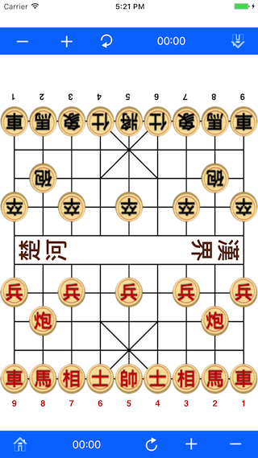

# Chinese Chess for Beginners

**Welcome!**   
When you think of Chess, you probably think of the strategy game played throughout Europe and the Americas. There is another kind of Chess played throughout the world by probably more people than any other strategy game. The game is Chinese Chess. The "Elephant Game" as it is called by the Chinese, dates back more than 2000 years. The origin of Western Chess, its unique style of play results in a wide-open, quick-moving and aggressive contest. It contains ancient oriental profound philosophy and wisdom.

**Chinese Chess for Beginners** explains the basic rules of the game clearly and in detail so that you can start playing right away.

Index of content:
------
* [Chess Board Introduction](board.md)
* [Rules of Chinese Chess](chess.md)
* [The Notation System](notation.md)
* [Checkmate Methods](checkmate.md)
* [Chess Idioms](idiom.md)
* [Read Kanji Characters in Chess](audio.html)

A funny app on App Store:  
Chinese Chess Reviewer, a pocket chess review, analyse and learning app, a powerful move Recorder and game records Player.
[http://sevenuc.com/en/reviewer.html](http://sevenuc.com/en/reviewer.html)   

