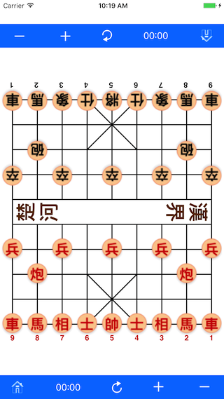

# Chinese Chess for Beginners

Chess Board
------
The board is made up of 9 vertical lines (files) and 10 horizontal lines (ranks), forming 72 squares, we call each square a cell. The central row of 8 squares are merged into a "river", dividing the board into two halves, the "river" marked with four Kanji characters (楚河漢界, which pronounced as Choh Hoh Hon Gaai, means border river of Choh and national boundary of Hon). On each side of the board, there is a "palace" consisting of 4 squares and two long diagonals. The files are numbered as 1 through 9, from right to left, and from each player’s perspective.

  
(fig 1).

Object of the Game
------
The object of the game is to win by either capturing the opponent’s King (checkmate) or rendering all the opponent’s pieces immobile (stalemate). Unlike International Chess, stalemate in Chinese Chess is not a draw.

The Pieces
------
Each side has 16 pieces, as shown in fig 1. The pieces are placed on the intersections of the lines (points). Fig 1 shows the initial setup of the pieces.

The name of the Chinese Chess pieces.

| Number  | Red  | Black | English Translation |Letter Re-presentation|
| ------- |:-------------:| -----:|--------:|:---:|
| 1       | 帥   | 將  | King     | K |
| 2       | 士   | 仕  | Adviser  | A |
| 2       | 相   | 象  | Elephant | E |
| 2       | 車   | 車  | chaRiot  | R |
| 2       | 馬   | 馬  | Horse    | H |
| 2       | 炮   | 砲  | Cannon   | C |
| 5       | 兵   | 卒  | Pawn     | P |

Pronunciation and meaning of pieces
------
| Name  | Pronunciation | English | Abbreviated Letter|
| ------- |:-------------:|:-----|:----:|
| 將      | Jeung | General     | K |
| 帥      | Sui  | Commander in chief  | K |
| 仕士    | Si  | Official adviser  | A |
| 相      | Seung | Looks; prime minister | E |
| 象      | Jeung | Seems; elephant   | E |
| 車      | Gui  |  Machine; chariot | R |
| 馬      | Ma | Horse | H |
| 炮砲    | Paau | Cannon  | C |
| 兵  |  Bing | Pawn;soldier  | P |
| 卒  |  Jut  | Pawn;soldier  | P |

# [ Back to home](https://chengdu.github.io/Chinese-Chess-for-Beginners/index.html)
# [ Next -> Rules of Chinese Chess](https://chengdu.github.io/Chinese-Chess-for-Beginners/chess.html)

