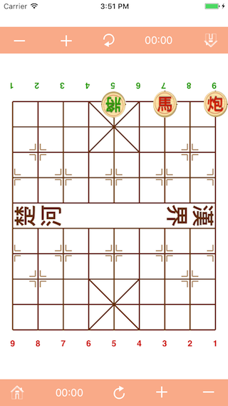

# Chinese Chess for Beginners

Checkmate
------

Simple Checkmate.

  

As shown in the figure above, it's not only a Checkmate, but also a Killing Skill, the black King cannot move horizontally because anywhere will be captured by the red Cannon, the only direction that it can move is forward a point, but unfortunately, that position captured by the red Horse, such situation means that Black has lost.

# [ Back to home](README.md)
# [ Next -> Chess Idioms](idiom.md)

