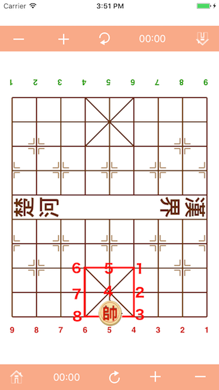
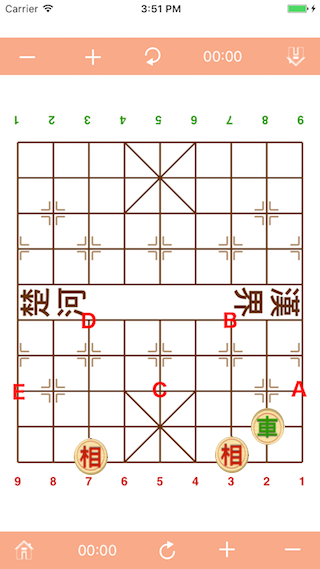
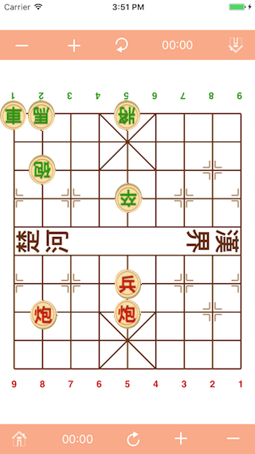

# Chinese Chess for Beginners

## Movements of Pieces

The King:
------
It only moves within the palace (the palace constructed with four cells, shaped as same as Kanji character 田 which pronounced as Tin, means rice field), one point either horizontally or vertically. There is a unique rule about the King, the two Kings must not be facing each other directly i.e. unobstructed by any other piece, along a file. If you have to move your King to directly face opponent’s King, it means you lose. King have nine points in the palace as indicated in fig 2.

  
(fig 2).

The Adviser:
------
It moves one point at a time along the diagonals within the palace. In other words, it can only occupy the centre and the four corners of the palace. Adviser have five points in the palace.

  
(fig 3).

The Elephant:
------
Elephant move on four cells (squares) that constructed a Kanji character 田, it moves on the diagonals of the four cells, i.e. moves exactly two points diagonally. Elephant cannot cross the river, so there are only seven points in the home camp which can ever be occupied by the Elephant. Further more, its movement will be blocked if there is a piece, be its friend or foe, at the intervening point, i.e. the centre of the four cells), there're eight such points on each side. Thus, in fig 4, the red Elephant can not go to point A because the centre of the four cells (squares) occupied by a black chaRiot.

  
(fig 4).

The Chariot:
------
The most powerful piece. It move on straight line, that means it can move forward, backward, or sideways any number of points in a single move, as long as the path is unobstructed by any type of other piece.

The Horse:
------
Horse moves on diagonals of two cells which constructed a Kanji character 日, vertically or horizontally. In Chinese term, "馬(horse)踏(tramp)日(day)角(diagonal)", pronounced as Ma Daap Yat Gok.

  
(fig 5).

Its move can be regarded as a combination of two steps:
(1) one point in any direction vertically or horizontally, followed by (2) one point diagonally further away. However, if the point next to the Horse is occupied by a piece (friend or foe), it’s movement in that direction is blocked and two points become inaccessible. In fig. 6, the red Horse cannot go to point 1 nor point 2, owing to the presence of the red Pawn on point A. Suppose we have a black Horse on point 3 or 4 and point B have a obstructed piece, the black Horse can capture the red Horse, whereas the red Horse cannot capture the black Horse. The four point A, B, C, D in fig 6 obstructed the red Horse to access the eight point that it can move to.

  
(fig 6).

The Pawn:
------
The Pawn never moves backward. It moves one point at a time, and can only move sideways after crossing the river.

The Cannon:
------
We describe the Cannon last because it is the most unique and interesting piece in Chinese Chess. All the other six types mentioned earlier move and capture in like manner. Whereas the Cannon moves like the Chariot, but it jump on straight line, capture opponent’s piece by jumping over a piece (friend or foe). In Chinese term, "炮(cannon)打(fire)翻(over)山(mountain)",  pronounced as Paau Da Faan Saan. Cannon must have one and only one piece to over, and the captured target must be the first piece after the over piece, the jump distance can as long as the line is not obstructed by any type of other piece.  In fig 7, the red Cannon can capture the black Pawn over the red Pawn, but it can not capture the black King. Another red Cannon can capture the black Horse, but the Horse protected by another piece, the sideways Chariot.

  
(fig 7).

# [ Back to home](README.md)
# [ Next -> The Notation System](notation.md)
