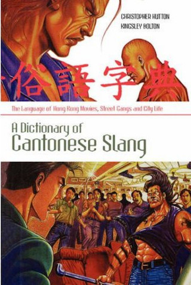

# Chinese Chess for Beginners

Chess idioms in daily life
------
Several funny idioms that references the rules of Chinese Chess.

飛象過河 [fēi jeuhng gwo hòh]
------
  
(An elephant flies across the river.)
1. To break a rule.
2. To reach across the table for food.  
Origin: [elephant over river](http://sevenuc.com/en/proverbs.html#elephant)  

事急馬行田 [sih gāp máah hàahng tìhn]
-----
  

(In a crisis, a horse can move in the field.)
To be flexible, to adapt to circumstances in an emergency. 
Origin: [horse break](http://sevenuc.com/en/proverbs.html#horse)  

食人隻車 [sihk yàhn jek gēui]
------
  

(To have eaten someone’s cart.)
To exploit or expropriate the belongings of others.  
Origin: [eat chariot](http://sevenuc.com/en/proverbs.html#chariot)  

More funny proverbs refers here:
------
   
[Funny Proverbs: http://sevenuc.com/en/proverbs.html](http://sevenuc.com/en/proverbs.html)  
------

# [ Back to home](https://chengdu.github.io/Chinese-Chess-for-Beginners/index.html)

